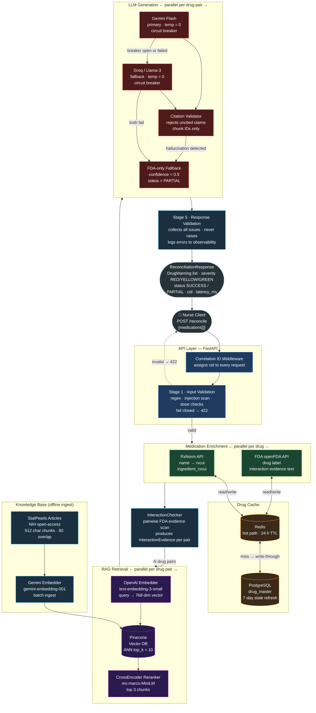

# MedReconcile AI — Architecture



## Request Path (left to right)

| Step | Component | What happens |
|---|---|---|
| 1 | **Correlation ID Middleware** | Assigns a `cid` to every request for end-to-end tracing |
| 2 | **Stage 1 Validation** | Regex + injection scan + Pydantic constraints. Fail closed → 422 |
| 3 | **Medication Enrichment** | RxNorm → rxcui. FDA → interaction evidence text. Parallel per drug |
| 4 | **Drug Cache** | Redis (24h) in front of PostgreSQL. Writes back on miss. 7-day background refresh |
| 5 | **InteractionChecker** | Builds all drug pairs from FDA evidence. Pure text scan |
| 6 | **RAG Retrieval** | Embed query → Pinecone ANN (top 10) → CrossEncoder rerank → top 3 chunks |
| 7 | **LLM Generation** | Gemini Flash → Groq fallback → citation validator → FDA fallback if all fail |
| 8 | **Stage 5 Validation** | Collects all response issues. Never raises — logs for observability |

## Failure modes

```
Stage 1 fails       → 422 immediately, no downstream calls
RxNorm/FDA fails    → drug goes into unverified_drugs, pipeline continues
Retrieval fails     → empty chunks, generator uses FDA-only path
Gemini fails        → circuit breaker trips, Groq takes over
Groq fails          → FDA-only DrugWarning, status = PARTIAL
Citation hallucination → response rejected, FDA fallback returned
Stage 5 fails       → logged, response still returned
```
